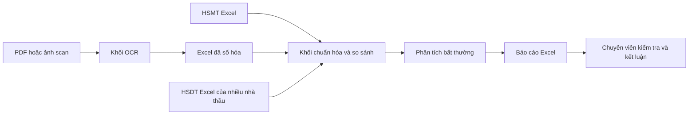
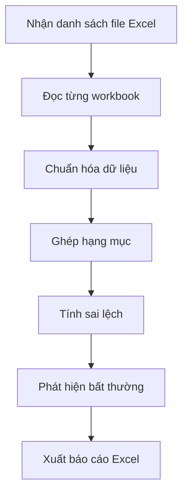
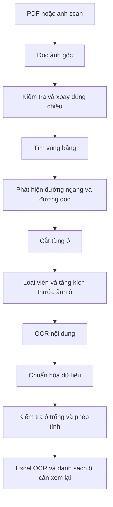
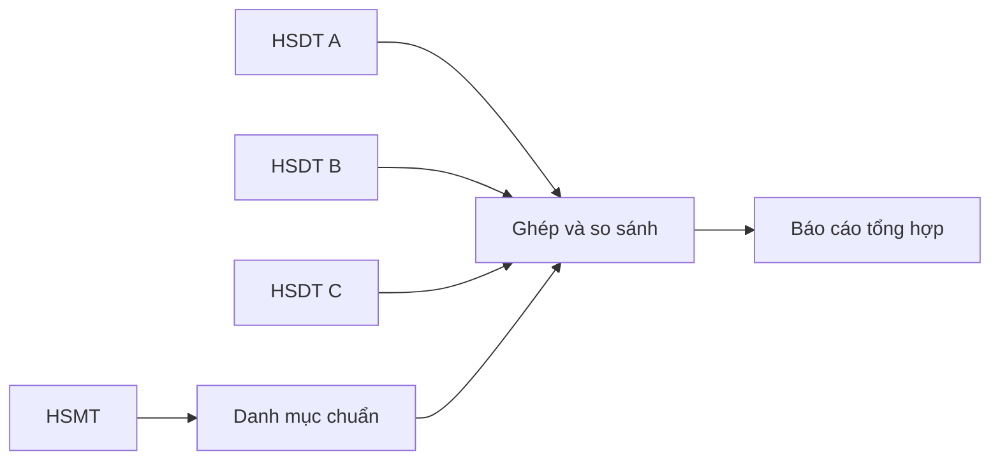
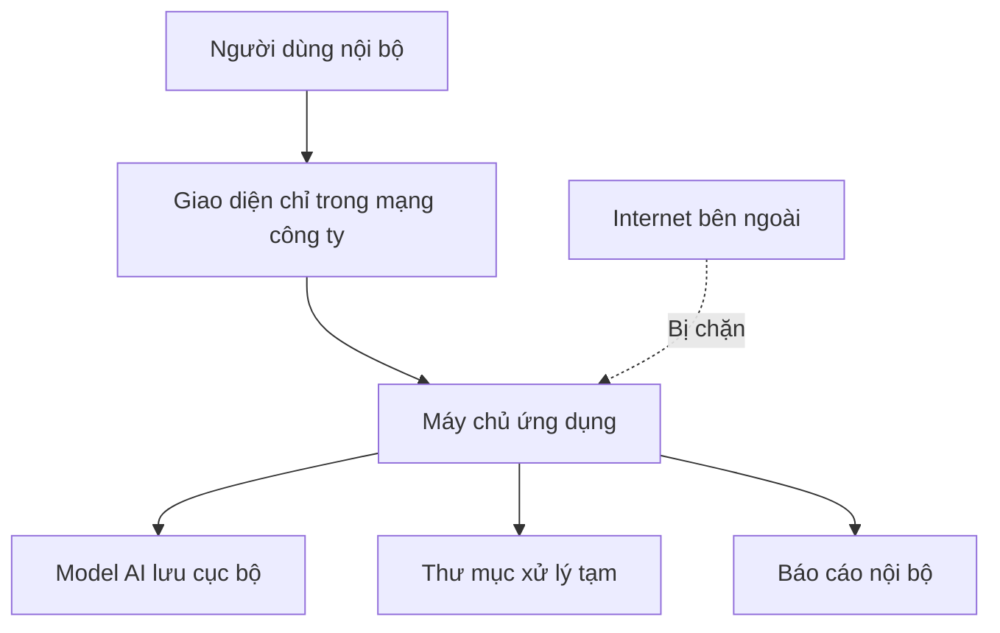

# HSMT Enterprise AI v7.0

## Tài liệu kiến trúc, ý tưởng và kế hoạch phát triển

> Hệ thống hỗ trợ số hóa hồ sơ scan, so sánh Hồ sơ mời thầu (HSMT) với Hồ sơ dự thầu (HSDT), so sánh nhiều HSDT giữa các nhà thầu và phát hiện các điểm bất thường cần chuyên viên kiểm tra.

---

## 1. Giới thiệu ngắn gọn

HSMT Enterprise AI v7.0 được xây dựng để giải quyết hai công việc thường mất nhiều thời gian trong quá trình kiểm tra hồ sơ thầu:

1. **Chuyển bảng trong PDF hoặc ảnh scan thành Excel.**
2. **So sánh tự động dữ liệu giữa HSMT và một hoặc nhiều HSDT.**

Hệ thống không thay thế chuyên viên thẩm định. Vai trò của hệ thống là:

- Đọc và sắp xếp dữ liệu nhanh hơn.
- Tìm các dòng có dấu hiệu bất thường.
- Chỉ ra lý do vì sao một dòng bị cảnh báo.
- Giảm số lượng dòng con người phải kiểm tra thủ công.
- Tạo báo cáo Excel dễ xem, dễ lưu trữ và dễ truy vết.

### Cách hiểu đơn giản

Có thể hình dung hệ thống giống như một **trợ lý kiểm tra hồ sơ**:

- Người dùng đưa cho trợ lý các file PDF scan hoặc Excel.
- Trợ lý đọc từng bảng và từng dòng.
- Trợ lý ghép các hạng mục tương ứng với nhau.
- Trợ lý kiểm tra giá, khối lượng, tên hạng mục và phép tính.
- Trợ lý đánh dấu màu những vị trí cần con người xem lại.
- Cuối cùng, trợ lý xuất một file Excel tổng hợp.

---

## 2. Mục tiêu của dự án

### 2.1. Mục tiêu nghiệp vụ

- Số hóa bảng từ PDF scan sang Excel.
- Hạn chế tình trạng dữ liệu OCR bị dồn sai cột.
- So sánh một HSMT với nhiều HSDT.
- So sánh trực tiếp nhiều HSDT khi không có file HSMT chuẩn.
- Phát hiện chênh lệch về:
  - Tên hạng mục.
  - Mã hiệu.
  - Đơn vị tính.
  - Khối lượng.
  - Đơn giá.
  - Thành tiền.
  - Thương hiệu.
  - Xuất xứ.
  - Quy cách vật tư.
- Phát hiện hạng mục bị thiếu hoặc xuất hiện ngoài danh mục.
- Tạo ma trận giá giữa các nhà thầu.
- Chấm điểm mức độ bất thường và giải thích nguyên nhân.

### 2.2. Mục tiêu kỹ thuật

- Xử lý được file Excel lớn mà không dùng quá nhiều RAM.
- Chạy OCR và mô hình AI hoàn toàn trong mạng nội bộ.
- Không gửi hồ sơ công ty lên dịch vụ AI bên ngoài.
- Có thể chạy phần so sánh Excel mà không cần GPU.
- Có thể mở rộng OCR bằng GPU khi doanh nghiệp có máy chủ phù hợp.
- Kết quả phải có thể kiểm tra lại, không chỉ đưa ra một điểm số bí ẩn.

### 2.3. Nguyên tắc an toàn

> AI chỉ đề xuất vị trí cần kiểm tra. Quyết định cuối cùng vẫn do chuyên viên chịu trách nhiệm.

Hệ thống không được tự động kết luận:

- Nhà thầu gian lận.
- Hồ sơ đạt hay không đạt.
- Nhà thầu nào chắc chắn được lựa chọn.

Hệ thống chỉ cung cấp:

- Dữ liệu đã trích xuất.
- Sai lệch đã tính toán.
- Điểm bất thường.
- Lý do cảnh báo.
- Bằng chứng để người dùng kiểm tra lại.

---

## 3. Bức tranh tổng thể của hệ thống



Hệ thống được chia thành bốn khối chính:

1. **Khối OCR:** đọc PDF hoặc ảnh scan.
2. **Khối đọc và chuẩn hóa Excel:** đưa các file khác nhau về cùng một cấu trúc dữ liệu.
3. **Khối so sánh và phát hiện bất thường:** ghép hạng mục và tính sai lệch.
4. **Khối báo cáo:** xuất kết quả thành file Excel.

---

## 4. Cấu trúc thư mục dự án

```text
HSMT_Enterprise_AI_v7/
├── app.py
├── cli.py
├── pyproject.toml
├── requirements.txt
├── requirements-dev.txt
├── requirements-ocr-gpu.txt
├── environment.yml
├── Dockerfile
├── docker-compose.yml
├── .env.example
│
├── core/
│   ├── __init__.py
│   ├── config.py
│   ├── models.py
│   ├── number_parser.py
│   ├── text_normalizer.py
│   ├── excel_reader.py
│   ├── matcher.py
│   ├── comparison.py
│   ├── anomaly.py
│   ├── reporter.py
│   └── pipeline.py
│
├── ocr/
│   ├── __init__.py
│   ├── config.py
│   ├── models.py
│   ├── pdf_io.py
│   ├── grid.py
│   ├── engines.py
│   ├── schema.py
│   ├── verify.py
│   ├── exporter.py
│   └── pipeline.py
│
├── security/
│   ├── __init__.py
│   └── runtime.py
│
├── scripts/
│   ├── benchmark_ocr.py
│   └── validate_models.py
│
├── tests/
│   ├── test_number_parser.py
│   ├── test_matcher.py
│   ├── test_excel_compare.py
│   ├── test_grid.py
│   └── test_security.py
│
├── data/
│   ├── HSMT_GoiM01.xlsx
│   ├── NT_MinhPhat_HSDT.xlsx
│   └── generate_samples.py
│
├── examples/
│   └── validation_report.xlsx
│
├── README.md
├── ARCHITECTURE.md
├── MODEL_SETUP_OFFLINE.md
├── SETUP.md
├── SETUP_OCR_SERVER.md
└── VALIDATION_REPORT.md
```

---

## 5. Giải thích từng khu vực trong dự án

### 5.1. `app.py` — giao diện người dùng

Đây là phần giao diện Streamlit.

Người dùng có thể:

- Tải HSMT lên.
- Tải nhiều HSDT lên.
- Chọn chế độ so sánh.
- Tải PDF scan để OCR.
- Điều chỉnh ngưỡng cảnh báo.
- Theo dõi tiến trình.
- Tải file Excel kết quả.

Có thể hiểu `app.py` là **quầy giao dịch** của hệ thống. Người dùng chỉ làm việc với phần này, không cần biết chi tiết các thuật toán bên trong.

### 5.2. `cli.py` — chạy tự động bằng dòng lệnh

`cli.py` được dùng khi:

- Xử lý nhiều file theo lô.
- Tích hợp vào server.
- Chạy theo lịch.
- Kết nối với một hệ thống quản lý hồ sơ khác.

Ví dụ:

```powershell
python cli.py compare `
  --hsmt HSMT.xlsx `
  --hsdt "Nhà thầu A=A.xlsx" `
  --hsdt "Nhà thầu B=B.xlsx" `
  --output Bao_cao.xlsx
```

---

## 6. Khối `core/` — đọc và so sánh Excel

### 6.1. `core/config.py`

Chứa các thiết lập chung như:

- Ngưỡng cảnh báo giá.
- Ngưỡng cảnh báo khối lượng.
- Trọng số chấm điểm tên.
- Số lượng ứng viên cần xét khi matching.
- Giới hạn dòng.
- Mã màu báo cáo.

Mục đích là giúp hệ thống có thể thay đổi chính sách mà không phải sửa thuật toán ở nhiều nơi.

### 6.2. `core/models.py`

Định nghĩa các đối tượng dữ liệu thống nhất, ví dụ:

- Một hạng mục trong HSMT.
- Một hạng mục trong HSDT.
- Một cặp hạng mục đã ghép.
- Một cảnh báo.
- Một kết quả so sánh.

Có thể hiểu đây là **mẫu phiếu chuẩn** mà mọi bộ phận trong hệ thống cùng sử dụng.

### 6.3. `core/number_parser.py`

Chuyển chuỗi số trong Excel thành số thật.

Ví dụ:

```text
1.234.567,89
1,234,567.89
1 234 567
(1.500.000)
0
```

đều phải được hiểu đúng.

Điểm quan trọng:

- Số `0` phải được giữ là `0`.
- Ô trống phải được hiểu là thiếu dữ liệu.
- Không được nhầm `0` với ô không có giá trị.

### 6.4. `core/text_normalizer.py`

Chuẩn hóa tên và mã hiệu trước khi so sánh.

Ví dụ:

```text
M-01
M 01
m01
M.01
```

có thể được chuẩn hóa về cùng một dạng.

Tên hạng mục cũng được xử lý:

- Chuyển về chữ thường để so sánh.
- Loại khoảng trắng thừa.
- Chuẩn hóa dấu câu.
- Chuẩn hóa một số từ viết tắt.
- Giữ lại nội dung quan trọng như kích thước, công suất và vật liệu.

### 6.5. `core/excel_reader.py`

Đọc file Excel theo cách tiết kiệm bộ nhớ.

Các nhiệm vụ chính:

- Mở workbook ở chế độ `read_only`.
- Đọc lần lượt từng dòng.
- Tự tìm dòng tiêu đề.
- Nhận dạng header một tầng hoặc nhiều tầng.
- Bỏ qua trang bìa và dòng chú thích.
- Gộp dữ liệu từ nhiều sheet.
- Ghi lại sheet nguồn và số dòng gốc.

Với file lớn, hệ thống không tải toàn bộ workbook vào RAM ngay từ đầu.

### 6.6. `core/matcher.py`

Đây là phần tìm xem một hạng mục trong file A tương ứng với hạng mục nào trong file B.

Hệ thống ghép theo nhiều tầng:

```text
1. Mã hiệu chính xác trong cùng nhóm hoặc cùng sheet
2. Mã hiệu chính xác trên toàn workbook
3. Tên chuẩn hóa giống hoàn toàn
4. Tìm ứng viên gần nhất bằng TF-IDF ký tự
5. Chấm điểm lại bằng RapidFuzz
6. Dùng BGE-M3 local cho các trường hợp khó
7. Bảo đảm ghép one-to-one
```

#### Vì sao không chỉ so sánh tên giống nhau?

Tên hạng mục giữa các nhà thầu có thể khác cách viết:

```text
Cáp điện Cu/XLPE/PVC 4x25 mm2
Cáp đồng XLPE PVC 4x25mm²
Cáp lực 4 lõi 25 mm2
```

Ba tên trên có thể cùng nói về một sản phẩm, nhưng cách viết khác nhau.

#### Ghép one-to-one là gì?

Một dòng của HSMT chỉ được ghép với tối đa một dòng của một HSDT. Điều này tránh tình trạng nhiều hạng mục cùng bị ghép nhầm vào một dòng.

### 6.7. `core/comparison.py`

Sau khi đã ghép được hai hạng mục tương ứng, module này tính:

- Chênh lệch khối lượng.
- Chênh lệch đơn giá.
- Chênh lệch thành tiền.
- Khác đơn vị tính.
- Khác tên hạng mục.
- Thiếu dữ liệu.
- Sai phép tính.
- Mức độ cảnh báo.

Ví dụ:

```text
Đơn giá HSMT: 1.000.000
Đơn giá HSDT: 1.350.000
Chênh lệch: 35%
Kết quả: Cảnh báo giá cao
```

### 6.8. `core/anomaly.py`

Phát hiện bất thường khi có nhiều HSDT.

Hệ thống không chỉ so với HSMT mà còn so sánh các nhà thầu với nhau.

Ví dụ:

| Nhà thầu | Đơn giá |
|---|---:|
| A | 100.000 |
| B | 105.000 |
| C | 102.000 |
| D | 350.000 |

Nhà thầu D có giá khác rất xa nhóm còn lại nên được đánh dấu để kiểm tra.

Các phương pháp chính:

- Trung vị.
- MAD, tức độ lệch tuyệt đối quanh trung vị.
- Robust Z-score.
- Isolation Forest làm tín hiệu bổ sung.

Hệ thống phải ghi rõ lý do, ví dụ:

```text
Đơn giá cao hơn trung vị 243%.
Robust Z-score vượt ngưỡng.
Tên hạng mục có độ tương đồng thấp.
```

### 6.9. `core/reporter.py`

Xuất báo cáo Excel.

Báo cáo dự kiến gồm:

1. `Tổng quan`
2. `Đối chiếu chi tiết`
3. `Bất thường`
4. `Ma trận giá`
5. `Thiếu và ngoài danh mục`
6. `Nhật ký & bảo mật`

Để xử lý báo cáo lớn, module ghi dữ liệu theo từng dòng, không giữ toàn bộ workbook kết quả trong RAM.

### 6.10. `core/pipeline.py`

Điều phối toàn bộ quá trình so sánh:



---

## 7. Khối `ocr/` — chuyển PDF scan thành Excel

## 7.1. Tư tưởng OCR của dự án

Các bảng hồ sơ thầu thường có:

- Rất nhiều cột.
- Chữ nhỏ.
- Nhiều đường kẻ.
- Tiêu đề nhiều tầng.
- Ô gộp.
- Số tiền dài.

Nếu đưa cả trang vào một mô hình AI và yêu cầu mô hình tự đoán bảng, mô hình có thể:

- Dồn nhiều ô vào một cột.
- Bỏ sót số.
- Nhầm vị trí hàng và cột.
- Tạo ra ký tự không có trong tài liệu.

Vì vậy dự án dùng cách **grid-first**:

> Xác định lưới bảng và vị trí từng ô trước, sau đó mới OCR nội dung trong từng ô.

### Luồng OCR tổng quát



### 7.2. `ocr/config.py`

Chứa cấu hình OCR:

- Model OCR đang sử dụng.
- Có dùng GPU hay không.
- Ngưỡng confidence.
- Kích thước phóng ảnh ô.
- Dung sai phép tính.
- Đường dẫn model local.
- Chế độ bảo mật nghiêm ngặt.

### 7.3. `ocr/models.py`

Định nghĩa:

- Trang PDF.
- Vùng bảng.
- Đường lưới.
- Ô bảng.
- Kết quả OCR của một ô.
- Trạng thái kiểm tra.

Mỗi ô nên giữ được:

- Số trang.
- Tọa độ.
- Nội dung OCR.
- Confidence.
- Engine đã đọc.
- Ảnh crop.
- Lý do cảnh báo.

### 7.4. `ocr/pdf_io.py`

Xử lý PDF và ảnh đầu vào:

- Kiểm tra PDF có lớp văn bản hay chỉ là scan.
- Lấy ảnh nhúng gốc khi có thể.
- Render trang khi cần.
- Đọc metadata xoay trang.
- Chuẩn hóa hướng hiển thị.
- Tính mã SHA-256 của file.

Mục tiêu là giữ chất lượng ảnh tốt nhất, không phóng ảnh vô ích nếu nguồn scan ban đầu đã mờ.

### 7.5. `ocr/grid.py`

Phát hiện cấu trúc bảng bằng OpenCV.

Các bước chính:

1. Chuyển ảnh sang grayscale.
2. Tăng tương phản nhẹ.
3. Tạo ảnh nhị phân.
4. Tách đường ngang.
5. Tách đường dọc.
6. Tìm giao điểm.
7. Xác định biên bảng.
8. Suy ra hàng, cột và ô.
9. Cắt ảnh từng ô.

Có thể hình dung module này giống như việc dùng thước để kẻ lại toàn bộ bảng trước khi đọc chữ.

### 7.6. `ocr/engines.py`

Điều phối các model OCR chạy cục bộ.

Chiến lược model:

- **PP-OCRv5:** đọc nội dung từng ô theo batch.
- **Tesseract tiếng Việt:** engine đối chiếu cho ô khó.
- **PP-TableMagic:** fallback khi bảng có cấu trúc phức tạp.
- **PP-StructureV3:** tài liệu hỗn hợp gồm bảng, đoạn văn và tiêu đề.
- **PaddleOCR-VL:** chỉ dùng cho vùng khó hoặc bảng không có lưới rõ.

Nguyên tắc quan trọng:

- Không chạy model nặng trên toàn bộ trang nếu không cần.
- Bỏ qua ô trắng trước khi inference.
- OCR theo batch để tăng tốc GPU.
- Chỉ OCR lần hai cho các ô confidence thấp.

### 7.7. `ocr/schema.py`

Xác định cột nào là:

- Số thứ tự.
- Mã hiệu.
- Tên hạng mục.
- Đơn vị.
- Khối lượng.
- Đơn giá.
- Thành tiền.
- Thương hiệu.
- Xuất xứ.
- Ghi chú.

Module này phải xử lý được header nhiều tầng và ô gộp.

Nếu biểu mẫu lặp lại giữa nhiều hồ sơ, doanh nghiệp có thể tạo template cố định để tăng độ chính xác.

### 7.8. `ocr/verify.py`

Đây là lớp kiểm tra sau OCR.

Các kiểm tra chính:

- Ô bắt buộc có bị trống hay không.
- Chuỗi số có đúng định dạng hay không.
- Có chữ lẫn trong cột tiền hay không.
- Khối lượng, đơn giá và thành tiền có hợp lý hay không.
- `Khối lượng × Đơn giá` có gần bằng `Thành tiền` hay không.
- Hai engine OCR có đưa ra kết quả giống nhau hay không.

Ví dụ:

```text
Khối lượng: 10
Đơn giá: 250.000
Thành tiền OCR: 2.800.000
Giá trị đúng theo phép nhân: 2.500.000
Kết quả: Cần kiểm tra
```

### 7.9. `ocr/exporter.py`

Xuất kết quả OCR thành Excel.

Báo cáo OCR gồm:

- `Dữ liệu OCR`
- `Ô cần kiểm tra`
- `Nhật ký OCR`

Đề xuất màu:

- Xanh: ô đủ tin cậy.
- Vàng: confidence thấp hoặc hai engine không thống nhất.
- Đỏ: sai phép tính hoặc thiếu dữ liệu bắt buộc.

### 7.10. `ocr/pipeline.py`

Điều phối toàn bộ quá trình OCR:

```text
Đọc PDF
→ chuẩn hóa trang
→ tìm bảng
→ phát hiện lưới
→ cắt ô
→ OCR
→ nhận dạng schema
→ kiểm chứng
→ xuất Excel
```

---

## 8. Ba chế độ nghiệp vụ chính

### 8.1. Chế độ 1 — HSMT so với nhiều HSDT



Kết quả cho biết:

- Nhà thầu nào thiếu hạng mục.
- Nhà thầu nào có hạng mục ngoài danh mục.
- Giá và khối lượng lệch bao nhiêu.
- Tên hoặc đơn vị tính có khác không.
- Dòng nào cần chuyên viên kiểm tra.

### 8.2. Chế độ 2 — So sánh nhiều HSDT với nhau

Dùng khi chưa có HSMT chuẩn hoặc muốn xem mặt bằng giá giữa các nhà thầu.

Hệ thống:

1. Tạo danh mục hợp nhất.
2. Ghép từng nhà thầu vào danh mục.
3. Tạo ma trận giá.
4. Tính trung vị.
5. Đánh dấu giá quá cao hoặc quá thấp.
6. Phát hiện tên và quy cách khác biệt.

### 8.3. Chế độ 3 — OCR rồi so sánh

Dùng khi HSDT chỉ có dạng scan.

```text
PDF scan
→ OCR sang Excel trung gian
→ người dùng xác nhận các ô nghi ngờ
→ đưa Excel đã xác nhận vào khối so sánh
→ xuất báo cáo cuối
```

Không nên bỏ qua bước xác nhận những ô OCR không chắc chắn.

---

## 9. Cách tính điểm bất thường

Điểm bất thường nằm trong khoảng từ `0` đến `100`.

Ví dụ cách chia trọng số:

| Nhóm kiểm tra | Trọng số gợi ý |
|---|---:|
| Chênh lệch đơn giá | 30% |
| Chênh lệch khối lượng | 20% |
| Khác tên hạng mục | 15% |
| Khác đơn vị tính | 10% |
| Thiếu dữ liệu | 10% |
| Sai phép tính | 10% |
| Tín hiệu mô hình bất thường | 5% |

Mức độ gợi ý:

| Điểm | Mức độ | Ý nghĩa |
|---:|---|---|
| 0–19 | Bình thường | Chưa phát hiện dấu hiệu đáng kể |
| 20–39 | Theo dõi | Có khác biệt nhỏ |
| 40–59 | Cảnh báo | Nên kiểm tra |
| 60–79 | Bất thường cao | Cần ưu tiên kiểm tra |
| 80–100 | Nghiêm trọng | Có nhiều dấu hiệu hoặc sai lệch lớn |

Điểm số phải luôn đi kèm lý do. Không được chỉ hiển thị một con số mà không giải thích.

---

## 10. Tối ưu hiệu năng cho file lớn

### 10.1. Đọc Excel theo luồng

Thay vì tải toàn bộ file vào bộ nhớ:

```text
Đọc một dòng
→ chuẩn hóa
→ lưu kết quả cần thiết
→ chuyển sang dòng tiếp theo
```

### 10.2. Không so sánh mọi dòng với mọi dòng

Nếu HSMT có 100.000 dòng và HSDT có 100.000 dòng, so sánh toàn bộ sẽ tạo ra 10 tỷ cặp.

Hệ thống dùng quy trình:

```text
Lọc theo mã hoặc nhóm
→ tìm top-K ứng viên gần nhất
→ chỉ chấm điểm chi tiết top-K
```

### 10.3. Chỉ dùng model semantic cho trường hợp khó

BGE-M3 không cần chạy cho mọi dòng.

Nó chỉ chạy khi:

- Mã không khớp.
- Tên chuẩn hóa không khớp chính xác.
- RapidFuzz chưa đủ chắc chắn.

### 10.4. OCR theo batch

Thay vì gửi từng ô một vào GPU, hệ thống gom nhiều ô thành một batch.

### 10.5. Chỉ OCR lại ô nghi ngờ

Các ô có confidence cao không cần chạy nhiều engine.

### 10.6. Xuất Excel theo constant-memory

Báo cáo được ghi tuần tự theo dòng để giảm lượng RAM sử dụng.

---

## 11. Kiến trúc bảo mật



### 11.1. Nguyên tắc bảo mật

- Không gửi file lên API cloud.
- Không cho model tự tải từ Internet trong production.
- Model phải được tải trước trên máy staging.
- Kiểm tra checksum model trước khi triển khai.
- Chỉ bind giao diện vào mạng nội bộ.
- Tắt kết nối ra ngoài bằng firewall và egress guard.
- Tệp tạm phải được xóa sau khi hoàn tất.
- Ghi SHA-256 của file nguồn để truy vết.
- Không ghi nội dung hồ sơ nhạy cảm vào log kỹ thuật.
- Phân quyền người dùng theo vai trò.

### 11.2. Luồng đưa model vào doanh nghiệp

```text
Máy staging có Internet
→ tải model từ nguồn chính thức
→ quét mã độc
→ kiểm tra checksum
→ phê duyệt model
→ chép sang kho model nội bộ
→ production chỉ đọc model local
```

### 11.3. Docker production

Khuyến nghị:

- Network nội bộ, không có Internet.
- Root filesystem chỉ đọc.
- Mount thư mục model ở chế độ read-only.
- Dùng `tmpfs` cho file tạm.
- Không chạy container bằng root.
- Bỏ Linux capabilities không cần thiết.
- Giới hạn RAM, CPU và GPU.

---

## 12. Kế hoạch triển khai theo giai đoạn

## Giai đoạn 1 — Chuẩn hóa yêu cầu và dữ liệu mẫu

### Mục tiêu

Hiểu chính xác doanh nghiệp đang sử dụng những mẫu hồ sơ nào.

### Công việc

- Thu thập các loại HSMT và HSDT thường gặp.
- Phân loại:
  - Excel chuẩn.
  - Excel nhiều sheet.
  - PDF có text.
  - PDF scan.
  - Ảnh chụp.
- Chọn 20–50 trang đại diện để làm ground truth OCR.
- Chọn 10–20 bộ HSMT/HSDT để kiểm thử so sánh.
- Xác định cột bắt buộc.
- Xác định ngưỡng cảnh báo nghiệp vụ.

### Kết quả đầu ra

- Danh sách biểu mẫu.
- Bộ dữ liệu kiểm thử.
- Quy tắc nghiệp vụ được phê duyệt.

---

## Giai đoạn 2 — Hoàn thiện OCR bảng scan

### Mục tiêu

Đọc đúng cấu trúc hàng và cột trước khi tối ưu độ chính xác ký tự.

### Công việc

- Hoàn thiện xoay trang tự động.
- Phát hiện ROI bảng.
- Phát hiện lưới bằng OpenCV.
- Hỗ trợ ô gộp.
- Tạo template cho biểu mẫu lặp lại.
- OCR từng ô bằng PP-OCRv5.
- Dùng engine thứ hai cho ô khó.
- Tạo màn hình xem ảnh ô cạnh kết quả OCR.
- Thêm kiểm tra phép tính.

### Tiêu chí chấp nhận

- Đúng số hàng và số cột.
- Các cột tiền không bị dồn sai vị trí.
- Ô không chắc chắn luôn được đưa vào danh sách kiểm tra.
- Không có lỗi sai âm thầm ở các cột số quan trọng.

---

## Giai đoạn 3 — Hoàn thiện so sánh Excel lớn

### Mục tiêu

Xử lý file lớn ổn định và ghép hạng mục chính xác.

### Công việc

- Tự dò header nhiều tầng.
- Đọc workbook theo luồng.
- Chuẩn hóa mã hiệu và tên.
- Matching theo mã, TF-IDF, RapidFuzz và BGE-M3 local.
- Bảo đảm one-to-one.
- Phát hiện duplicate.
- Thêm HSMT-vs-HSDT và HSDT-vs-HSDT.
- Tạo ma trận giá.
- Thêm Robust Z-score và Isolation Forest.

### Tiêu chí chấp nhận

- Không ghi đè dòng trùng mã.
- Dữ liệu thiếu không bị đánh dấu `OK`.
- Giá trị `0` được xử lý đúng.
- Matching có lý do và confidence.
- Có thể xử lý file lớn trong giới hạn RAM đã đặt.

---

## Giai đoạn 4 — Giao diện kiểm duyệt

### Mục tiêu

Giúp người dùng không chuyên có thể sử dụng dễ dàng.

### Công việc

- Thiết kế quy trình ba bước:
  1. Tải file.
  2. Xem cảnh báo.
  3. Tải báo cáo.
- Hiển thị tiến trình.
- Cho xem ảnh crop của ô OCR.
- Cho sửa dữ liệu OCR trước khi so sánh.
- Cho chấp nhận hoặc từ chối kết quả matching.
- Lưu lịch sử chỉnh sửa.

### Tiêu chí chấp nhận

- Người dùng không cần chạy lệnh.
- Mỗi cảnh báo có lý do dễ hiểu.
- Có thể quay lại kiểm tra dữ liệu nguồn.

---

## Giai đoạn 5 — Bảo mật và triển khai nội bộ

### Mục tiêu

Bảo đảm hồ sơ không rời khỏi hạ tầng doanh nghiệp.

### Công việc

- Đóng gói Docker.
- Thiết lập mạng không egress.
- Chuẩn bị kho model nội bộ.
- Thêm xác thực và phân quyền.
- Mã hóa dữ liệu lưu trữ.
- Thiết lập xóa file tạm.
- Thêm audit log.
- Kiểm thử lỗ hổng.

### Tiêu chí chấp nhận

- Không có kết nối ngoài khi chạy production.
- Model chỉ được đọc từ thư mục local.
- File tạm bị xóa đúng chính sách.
- Có thể truy vết ai đã chạy, chạy file nào và tạo báo cáo nào.

---

## Giai đoạn 6 — Kiểm thử tải và nghiệm thu

### Mục tiêu

Xác nhận hệ thống đủ ổn định trước khi sử dụng chính thức.

### Công việc

- Kiểm thử Excel hàng chục nghìn đến hàng trăm nghìn dòng.
- Kiểm thử nhiều nhà thầu cùng lúc.
- Kiểm thử PDF nhiều trang.
- Đo tốc độ OCR CPU và GPU.
- Đo RAM tối đa.
- Đo độ chính xác matching.
- Đo độ chính xác số OCR.
- Đo tỷ lệ cảnh báo sai.

### Chỉ số cần theo dõi

| Chỉ số | Ý nghĩa |
|---|---|
| Numeric Cell Exact Match | Tỷ lệ ô số được đọc đúng hoàn toàn |
| Character Error Rate | Tỷ lệ ký tự OCR bị sai |
| Row/Column Accuracy | Dữ liệu có nằm đúng hàng và cột không |
| Matching Precision | Tỷ lệ cặp hạng mục ghép đúng |
| Silent Error Rate | Tỷ lệ sai nhưng hệ thống không cảnh báo |
| Review Rate | Tỷ lệ ô hoặc dòng cần con người kiểm tra |
| Processing Time | Thời gian xử lý |
| Peak RAM | RAM cao nhất |

---

## 13. Kế hoạch nâng cấp dài hạn

### 13.1. Template thông minh theo doanh nghiệp

Lưu cấu trúc từng biểu mẫu để lần sau hệ thống nhận dạng nhanh hơn.

### 13.2. Học từ chỉnh sửa của chuyên viên

Khi chuyên viên sửa matching hoặc OCR, hệ thống có thể lưu lại để cải thiện từ điển và template nội bộ.

Không nên tự động huấn luyện lại model mà không có bước kiểm duyệt.

### 13.3. Kho từ điển vật tư

Xây dựng danh mục:

- Tên vật tư chuẩn.
- Từ viết tắt.
- Thương hiệu.
- Xuất xứ.
- Đơn vị tính.
- Quy cách thường gặp.

### 13.4. Dashboard thống kê

Hiển thị:

- Số hồ sơ đã xử lý.
- Số dòng bất thường.
- Nhà thầu có nhiều cảnh báo.
- Nhóm vật tư có biến động giá lớn.
- Thời gian tiết kiệm được.

### 13.5. Tích hợp hệ thống nội bộ

Có thể tích hợp với:

- Hệ thống quản lý văn bản.
- Hệ thống quản lý đấu thầu.
- Kho lưu trữ tài liệu.
- Hệ thống ký số.
- LDAP hoặc Active Directory.

---

## 14. Kết quả Excel cuối cùng

### Sheet `Tổng quan`

- Số file đã xử lý.
- Số hạng mục.
- Số dòng bình thường.
- Số dòng cảnh báo.
- Số dòng bất thường cao.
- Tổng giá trị từng nhà thầu.

### Sheet `Đối chiếu chi tiết`

- Hạng mục chuẩn.
- Hạng mục của nhà thầu.
- Điểm matching.
- Chênh lệch giá.
- Chênh lệch khối lượng.
- Điểm bất thường.
- Lý do.

### Sheet `Bất thường`

Chỉ chứa các dòng cần ưu tiên kiểm tra.

### Sheet `Ma trận giá`

| Hạng mục | Nhà thầu A | Nhà thầu B | Nhà thầu C | Trung vị |
|---|---:|---:|---:|---:|
| Hạng mục 1 | 100 | 105 | 350 | 105 |

### Sheet `Thiếu và ngoài danh mục`

- Hạng mục HSMT không có trong HSDT.
- Hạng mục HSDT không có trong HSMT.

### Sheet `Nhật ký & bảo mật`

- Tên file.
- SHA-256.
- Thời gian xử lý.
- Phiên bản hệ thống.
- Cấu hình ngưỡng.
- Model đã dùng.

---

## 15. Cách chạy hệ thống

### 15.1. Chạy giao diện

```powershell
python -m venv .venv
.\.venv\Scripts\Activate.ps1
pip install -r requirements.txt
streamlit run app.py
```

### 15.2. So sánh HSMT với nhiều HSDT

```powershell
python cli.py compare `
  --hsmt HSMT.xlsx `
  --hsdt "Nhà thầu A=A.xlsx" `
  --hsdt "Nhà thầu B=B.xlsx" `
  --output Bao_cao_HSMT_HSDT.xlsx
```

### 15.3. So sánh nhiều HSDT

```powershell
python cli.py compare-bidders `
  --hsdt "Nhà thầu A=A.xlsx" `
  --hsdt "Nhà thầu B=B.xlsx" `
  --hsdt "Nhà thầu C=C.xlsx" `
  --output So_sanh_cac_HSDT.xlsx
```

### 15.4. OCR PDF scan

```powershell
python cli.py ocr `
  --input Ho_so_scan.pdf `
  --output Ho_so_scan_OCR.xlsx
```

---

## 16. Những điều hệ thống làm được và chưa nên làm

### Hệ thống làm tốt

- Tự động đọc và sắp xếp lượng dữ liệu lớn.
- Tìm chênh lệch nhanh.
- Đưa ra danh sách ưu tiên kiểm tra.
- Giải thích lý do cảnh báo.
- Tạo báo cáo thống nhất.

### Hệ thống chưa nên tự quyết định

- Loại hồ sơ.
- Kết luận gian lận.
- Xếp hạng nhà thầu chỉ dựa trên điểm bất thường.
- Tin tuyệt đối vào OCR không có bước kiểm tra.

---

## 17. Tóm tắt dành cho người không chuyên

Hệ thống hoạt động theo sáu bước:

1. Người dùng đưa vào PDF scan hoặc file Excel.
2. Nếu là PDF scan, hệ thống tìm bảng và đọc từng ô.
3. Hệ thống chuẩn hóa tên, mã và số liệu.
4. Hệ thống tìm các hạng mục tương ứng giữa các file.
5. Hệ thống tính chênh lệch và đánh dấu những điểm đáng chú ý.
6. Hệ thống xuất file Excel để chuyên viên kiểm tra và đưa ra quyết định.

Điểm khác biệt quan trọng của dự án là:

- **Không gửi dữ liệu ra ngoài công ty.**
- **Không tin tuyệt đối vào AI.**
- **Mỗi cảnh báo đều có lý do.**
- **Dữ liệu thiếu không được coi là bình thường.**
- **Các số quan trọng phải qua kiểm tra phép tính.**
- **Con người luôn giữ quyền quyết định cuối cùng.**

---

## 18. Kết luận

HSMT Enterprise AI v7.0 được định hướng trở thành một nền tảng hỗ trợ kiểm tra hồ sơ thầu nội bộ, tập trung vào ba yếu tố:

1. **Chính xác:** OCR theo từng ô, kiểm tra số và phép tính.
2. **Hiệu quả:** đọc file lớn theo luồng và chỉ dùng model nặng khi cần.
3. **Bảo mật:** toàn bộ file và model được xử lý trong hạ tầng doanh nghiệp.

Kiến trúc này cho phép triển khai từng phần. Doanh nghiệp có thể bắt đầu với chức năng so sánh Excel, sau đó bổ sung OCR GPU, giao diện kiểm duyệt và tích hợp hệ thống nội bộ khi dữ liệu kiểm thử đã đủ tốt.
